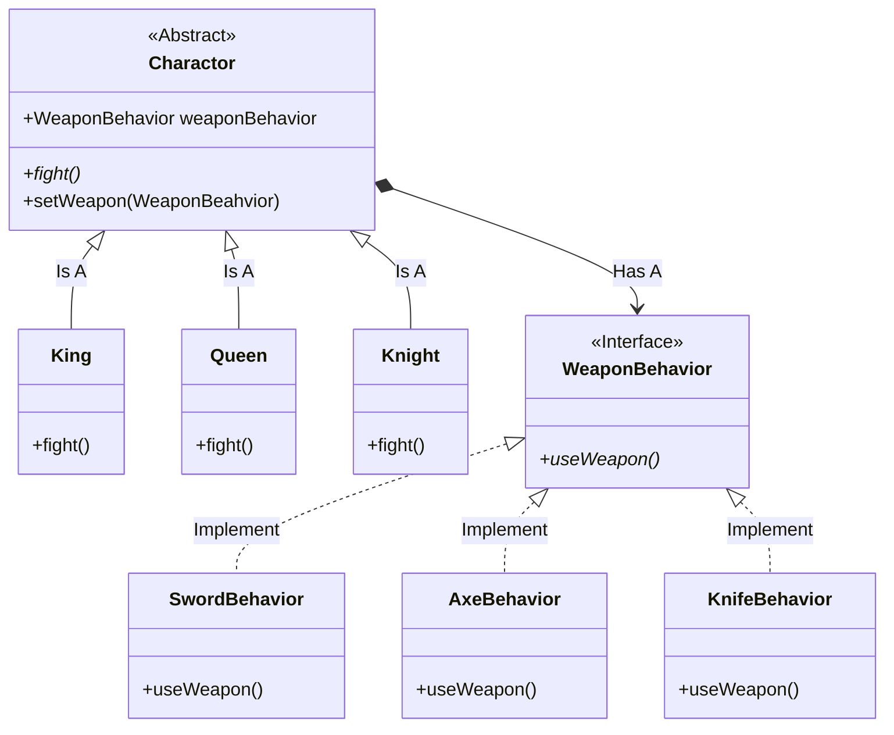

## 策略模式

- by Head First 设计模式:
    > 策略模式定义了算法族，分别封装起来，让他们之间可以互相替换。此模式让算法的**变化**独立于使用算法的"客户"。

- by Dive into Design Patterns:
    > **Strategy** is a behavioral design pattern that lets you define a family of algorithms,
  > put each of them into a separate class, and make their objects interchangeable.

  <!--more-->

### 设计原则

1. 找出应用之中可以变化之处，把它们独立出来，不要和那些不需要变化的代码混在一起
2. 针对接口编程，而不是针对实现编程
   - 客户的行为可以抽象为接口的，不必让客户去实现接口。如果这样做，客户想改变行为需要不断地去编写
   实现。这样的行为，可以理解为针对实现编程。
   - 鉴于此，可以在别处实现接口，客户只需要根据接口来选择合适的行为，这样做客户的代码更简洁且便于
   维护。
3. 多用组合，少用继承
   - 将两（多）个类组合起来使用，就是组合（*composition*），这样比使用继承好的一点是：系统的弹性
   更大，并且可以避免使用继承不得不出现的无意义重写（*override*）一些需要规避掉的方法。

### UML简图


classDiagram
    direction UD
    class Charactor{
        << Abstract >>
        +WeaponBehavior weaponBehavior
        +fight()*
        +setWeapon(WeaponBeahvior)
    }
    Charactor <|-- King: Is A
    class King
    King: +fight()
    class Queen
    Queen: +fight()
    Charactor <|-- Queen: Is A
    class Knight
    Knight: +fight()
    Charactor <|-- Knight: Is A
    
    class WeaponBehavior
    Charactor *--> WeaponBehavior : Has A
    << Interface >> WeaponBehavior
    WeaponBehavior: +useWeapon()*
    
    calss SwordBehavior
    WeaponBehavior <|.. SwordBehavior : Implement
    SwordBehavior: +useWeapon()
    calss AxeBehavior
    WeaponBehavior <|.. AxeBehavior : Implement
    AxeBehavior: +useWeapon()
    class KnifeBehavior
    WeaponBehavior <|.. KnifeBehavior: Implement
    KnifeBehavior: +useWeapon()





### 示例代码

#### 抽象角色

```java
public abstract class Duck {

    // 定义角色的可变行为
    protected FlyBehavior flyBehavior;
    protected QuarkBehavior quarkBehavior;

    // 不变的部分
    public abstract void swim();

    public abstract void display();

    // fly and quark
    // 由于并不是所有的"鸭子"实现不能都会飞或者叫
    // 实际开发中经常遇到实现并不需要全部的功能这种情况
    // 于是把"变化的部分"独立出去，鸭子类更易于拓展，否则可能需要处理很多无用的覆写啦😄
    // 实际上变化的功能，交给具体的实现去做啦
    /*
     * PS: 让鸭子实现直接实现FlyBehavior接口的话，也相当于只做了一半的工作。改变鸭子的行为，
     *     依然需要改变实现，这就是所谓"面对实现编程"
     */
    public void performFly() {
        flyBehavior.fly();
    }

    public void performQuark() {
        quarkBehavior.quark();
    }

    // 通过使用策略模式，不局限于规范行为的接口，可以动态改变实现的行为
    public void setFlyBehavior(FlyBehavior fb) {
        this.flyBehavior = fb;
    }

    public void setQuarkBehavior(QuarkBehavior qb) {
        this.quarkBehavior = qb;
    }
}
```

#### 具体角色

```java
public class MallardDuck extends Duck {

    public MallardDuck() {
        this.quarkBehavior = new Quark();
        this.flyBehavior = new FlyWithWings();
    }
    @Override
    public void swim() {
        //...
    }
    @Override
    public void display() {
        //...
    }
}
```

#### 可变行为

可变行为一般有多个实现，这样才能实现策略嘛。比如支付通道什么的😄️。这里只简单贴点代码。

```java
// 要实现策略，它肯定有多个实现啦
public interface FlyBehavior { 
    void fly();
}
public class FlyWithWings implements FlyBehavior{

    @Override
    public void fly() {
        System.out.println("Yes! I can fly with wings!");
    }
}

// 另一个行为
public interface QuarkBehavior {
    void quark();
}
public class Quark implements QuarkBehavior{
    @Override
    public void quark() {
        System.out.println("Quark!");
    }
}
```

#### 客户端代码

```java
public class DuckTest {

    public static void main(String[] args) {
        // 这种🦆的飞/叫行为已经在策略里定义了
        MallardDuck mock = new MallardDuck();
        mock.performFly();
        mock.performQuark();
        // 改变行为（策略）试试
        mock.setFlyBehavior(new FlyWithRocket());
        mock.performFly();
    }
}
```

[更加详细的代码](https://github.com/wangy325/java-review/blob/d6d740b5a9b5de3f7d64579288b1b8c96c8b8da5/src/main/java/com/wangy/designpattern/behavioral/strategy)


