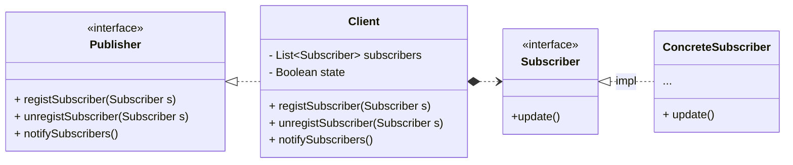

## 观察者模式

- by Head First 设计模式
  > 在对象之间建立一对多的依赖，这样一来，当一个对象的状态改变，依赖它的对象都会收到通知，并且自动更新。
- by Dive into Design Patterns:
  > *Also Known as: Event-Subscriber, Listener*
  >
  > Observer is a behavioral design pattern that lets you define a *subscription mechanism*
    to notify multiple objects about any events that happen to the object they’re observing.

<!--more-->

### 设计原则

1. 找出应用之中可以变化之处，把它们独立出来，不要和那些不需要变化的代码混在一起
2. 针对接口编程，而不是针对实现编程
3. 多用组合，少用继承
4. 为交互对象的*松耦合*设计而努力
    - 事实上，不用设计模式也可以硬编码出发布者-订阅者工作模式的代码，只不过发布者与订阅者呆在一起，会比较臃肿😮，
    也不利于扩展。
    - 在观察者模式中，被观察者（发布者）与观察者（订阅者）是松耦合的，发布者并不关心订阅者的具体细节，只需要知道
    其订阅与否，就知道状态变化后是否对其发送通知；同样地，订阅者也不关心发布者如何通知它，只需要处理好自己收到
    通知的业务就行了😊
    - 松耦合的设计优势得以体现：代码有层次感，易于拓展和维护。

> 想想看MVC开发模式，这是不是松耦合的设计呢？控制层、模型层、视图层分别有自己的业务范围


### UML简图


classDiagram
direction LR
class Publisher {
  << interface >>
  + registSubscriber(Subscriber s)
  + unregistSubscriber(Subscriber s)
  + notifySubscribers()
}

Publisher <|.. Client
Client *..> Subscriber
class Client {
  - List~Subscriber~ subscribers
  - Boolean state
  + registSubscriber(Subscriber s)
  + unregistSubscriber(Subscriber s)
  + notifySubscribers()
}
class Subscriber {
  << interface >>
  +update()
}
Subscriber <|.. ConcreteSubscriber : impl
class ConcreteSubscriber {
  ...
  + update()
}




### 笔记

1. 观察者模式定义了对象之间一对多的关系。
2. 发布者（被观察者）用一个统一的接口来更新观察者。
3. 发布者和订阅者之间使用*松耦合*（*loosecoupling*）的方式结合，订阅者不知道观察者的细节，只知道观察者实现观察者接口。
4. 使用此模式时，订阅者可以从发布者处"推"或者"拉"数据， 不过"推"一般被认为是正确的方式。
5. 有多个订阅者时，可以不依赖特性的通知顺序。
6. Java提供了此模式的包，包括`java.util.Observable`（*Deprecated since Java 9*）。
7. 此模式被用在其他地方，如JavaBeans，RMI。


### 示例代码

#### 发布者

``` java
public interface Subject {
    void registerBoard(Board board);
    void unregisterBoard(Board board);
    void notifyBoard();
    // other businesses
}

public class WeatherStation implements Subject {

    // 并发风险
    private List<Board> boards;
    private boolean status;

    public WeatherStation() {
        this.boards = new LinkedList<>();
        this.status = false;
    }

    @Override
    public void registerBoard(Board board) {
        if (!boards.contains(board)){
            boards.add(board);
        }
    }

    @Override
    public void unregisterBoard(Board board) {
        boards.remove(board);
    }

    @Override
    public void notifyBoard() {
        if (status){
            for (Board board : boards) {
                board.update(this);
            }
            status = false;
        }
    }

    public void setStatus(boolean status) {
        this.status = status;
    }

    private float temperature;
    private float humidity;
    private float pressure;

   public void setData(float temperature, float humidity, float pressure){
       this.temperature = temperature;
       this.humidity = humidity;
       this.pressure = pressure;
       this.status = true;
       notifyBoard();  // set and notify subscriber
   }
    // getters
    // other business
}
```

####  订阅者

```java
public interface Board {

    // 观察者收到通知之后的更新，方法参数可以是指定字段或者实体
    void update(WeatherStation client);
}

public class StatisticsBoard implements Board {
    @Override
    public void update(WeatherStation client) {
        System.out.printf("Average weather of this month:" +
                "\n Average Temperature %.2f celsius" +
                "\n Average Humidity %.2f" +
                "\n Average Pressure %.2f\n",
            client.getTemperature(),
            client.getHumidity(),
            client.getPressure());
    }
}
```

#### 客户端

```java
public class WeatherStationClient {
    public static void main(String[] args) {
        WeatherStation client = new WeatherStation();
        // register a new listener
        StatisticsBoard statisticsBoard =  new StatisticsBoard();
        client.registerBoard(statisticsBoard);
        client.setData(23.2f, 10.91f, 1.01f);
    }
}
```

[更加详细的代码](https://github.com/wangy325/java-review/blob/d6d740b5a9b5de3f7d64579288b1b8c96c8b8da5/src/main/java/com/wangy/designpattern/behavioral/observer)
