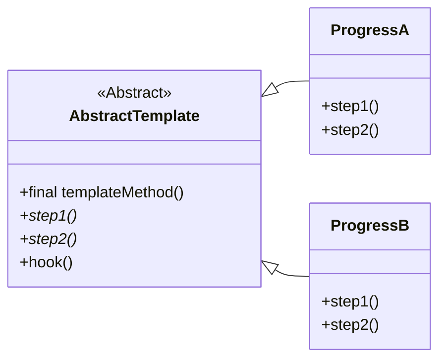

## 模板方法模式

模板方法模式在一个方法中定义一个算法的骨架，而将一些步骤
延迟到子类中。模板方法可以使得子类在不改变算法结构的前提
下，重新 定义算法的某些步骤。

<!--more-->

### 开发原则

- 针对接口编程，而不是针对实现编程
- 多用组合，少用继承
- 为交互对象之间的松耦合而努力
- 类应该对拓展开放，而对修改关闭 （开放-关闭原则）
- 依赖抽象，而不依赖具体类 （依赖倒置原则）
- "最少知识原则"——只和你的朋友交谈，不要让太多的类耦合在一起
- "好莱坞原则"——别调用我们，我们会调用你

#### 好莱坞原则：定义

好莱坞原则定义了一种防止"依赖腐败"的方法。当高层组件依赖底层组件时，
而低层组件又依赖高层组件，而高层组件又依赖边侧组件，边侧组件又
依赖低层组件时，依赖腐败就发生了。

> 简而言之，「好莱坞原则」希望系统设计能规避环形依赖。

在好莱坞原则上，高层组件依赖低层组件（违反依赖倒置原则），但是
高层组件决定什么时候如何使用低层组件，而低层组件不允许调用
高层组件。


#### 好莱坞原则：和模板方法的关系

模板方法运用了好莱坞原则，模板方法需要子类来实现具体细节。只有在需要
子类来实现细节时，才会调用子类的方法。而子类如果没有主动调用，绝对
不会调用抽象类。

> 工厂方法，观察者模式也运用了「好莱坞模式」。

### 在模板方法中使用钩子（Hook）

在模板方法中，还有一种特殊的运用——钩子。利用钩子，可以使子类实现
细节的策略更加灵活。

钩子利用在模板内实现，是否覆盖由子类决定。

### UML简图


classDiagram
direction RL
class AbstractTemplate {
    << Abstract >>
    +final templateMethod()
    +step1()*
    +step2()*
    +hook()
}
ProgressA --|> AbstractTemplate
class ProgressA{
    +step1()
    +step2()
}
ProgressB --|> AbstractTemplate
class ProgressB{
    +step1()
    +step2()
}




### 要点

- 模板方法定义了算法的步骤，并且把步骤的实现延迟到子类。
- 利用模板方法，代码可以很好的复用。
- 模板方法的抽象类可以定义具体方法，抽象方法和钩子。
- 钩子是一种方法，它在模板方法中不做事，或者只做默认的事情。
- 模板方法可以声明为`final`，以防止子类篡改算法逻辑。
- 好莱坞原则允许高层组件依赖低层组件，但是低层组件不能调用
高层组件的方法，必须由高层组件决定何时、如何调用。
- 策略模式和模板方法都是封装算法，前者使用组合，后者使用继承。
- *工厂方法是模板方法的特殊版本。*

### 示例代码

> 以下示例代码由[gpt4o](https://platform.openai.com/docs/models/gpt-4o)生成。

```java
// 抽象类定义算法骨架
abstract class Game {
    // 模板方法，为防止子类修改，一般使用final修饰
    public final void play() {
        initialize();
        startPlay();
        endPlay();
    }

    // 具体方法
    private void initialize() {
        System.out.println("Game is initializing...");
    }

    // 抽象方法
    protected abstract void startPlay();

    // 具体方法
    private void endPlay() {
        System.out.println("Game is ending...");
    }
}

// 具体子类实现特定步骤
class Cricket extends Game {
    @Override
    protected void startPlay() {
        System.out.println("Cricket Game Started. Enjoy the game!");
    }
}

class Football extends Game {
    @Override
    protected void startPlay() {
        System.out.println("Football Game Started. Enjoy the game!");
    }
}

// 测试模板方法模式
public class TemplateMethodPatternDemo {
    public static void main(String[] args) {
        Game game = new Cricket();
        game.play();
        System.out.println();
        game = new Football();
        game.play();
    }
}
```

在这个示例中：

- `Game`类是一个抽象类，定义了`play`方法作为模板方法。这个方法定义了算法的骨架，依次调用`initialize`，`startPlay` 和 `endPlay` 方法。
- `initialize` 和 `endPlay` 方法在 `Game` 类中是具体方法，所有子类都共享这部分实现。
- `startPlay` 方法在 `Game` 类中是抽象方法，具体的实现留给子类 `Cricket` 和 `Football` 来完成。
- 在 `TemplateMethodPatternDemo` 类中，我们创建了 `Cricket` 和 `Football` 对象，并调用它们的 `play` 方法，这将触发模板方法模式中的一系列步骤。

运行上述代码，输出结果为：

```shell
Game is initializing...
Cricket Game Started. Enjoy the game!
Game is ending...

Game is initializing...
Football Game Started. Enjoy the game!
Game is ending...
```

[更加详细的示例代码](https://github.com/wangy325/java-review/blob/465d701226c8402c4f8f3ec924eb0a3261bd79cb/src/main/java/com/wangy/designpattern/behavioral/template_method)


