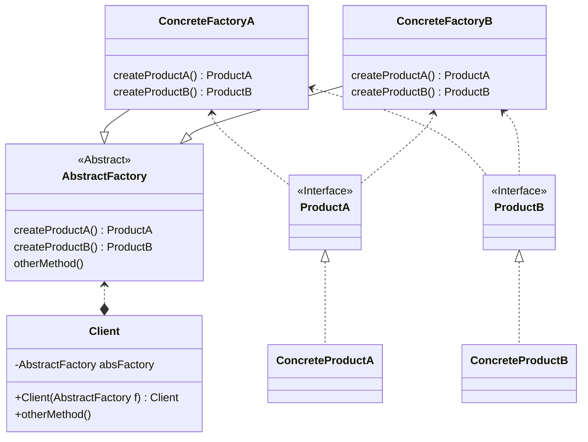

## 抽象工厂模式

- by Head First 设计模式
  > 抽象工厂模式提供了一个接口，用于创建相关或依赖对象的家族，而不需要指定具体类。
  > 简而言之，抽象工厂可以创建一群对象，而不单单只创建一种对象。

- by Dive into Design Patterns
  > **Abstract Factory** is a creational design pattern that lets you
  > produce families of related objects without specifying their
  > concrete classes.

  <!--more-->

### UML简图


classDiagram
class AbstractFactory {
  << Abstract >>
  createProductA() ProductA
  createProductB() ProductB
  otherMethod()
}

ConcreteFactoryA --|> AbstractFactory
class ConcreteFactoryA{
  createProductA() ProductA
  createProductB() ProductB
}
ConcreteFactoryB --|> AbstractFactory
class ConcreteFactoryB {
  createProductA() ProductA
  createProductB() ProductB
}

ConcreteFactoryA <.. ProductA
ConcreteFactoryA <.. ProductB
class ProductA {
  << Interface >>
}

ProductA <|.. ConcreteProductA
class ConcreteProductA

ConcreteFactoryB <.. ProductA
ConcreteFactoryB <.. ProductB
class ProductB {
  << Interface >>
}
ProductB <|.. ConcreteProductB
class ConcreteProductB

AbstractFactory <..* Client
class Client {
  -AbstractFactory absFactory
  +Client(AbstractFactory f) Client
  +otherMethod()
}




### 设计原则

- 针对接口编程，而不是针对实现编程
- 多用组合，少用继承
- 为交互对象之间的松耦合而努力
- 类应该对拓展开放，而对修改关闭 （开放-关闭原则）
- 依赖抽象，而不依赖具体类 （依赖倒置原则）

### 示例代码

> Generated by `gpt-4-tubo`

抽象工厂模式是一种创建型设计模式，它提供了一种方式，可以封装一组具有共同主题的单独的工厂，而不需要指定它们的具体类。这里给出一个简单的抽象工厂模式的示例，使用Java语言实现。

首先，定义抽象产品类和具体产品类：

```java
// 抽象产品A
interface ProductA {
    void use();
}

// 具体产品A1
class ProductA1 implements ProductA {
    public void use() {
        System.out.println("Using ProductA1");
    }
}

// 具体产品A2
class ProductA2 implements ProductA {
    public void use() {
        System.out.println("Using ProductA2");
    }
}

// 抽象产品B
interface ProductB {
    void use();
}

// 具体产品B1
class ProductB1 implements ProductB {
    public void use() {
        System.out.println("Using ProductB1");
    }
}

// 具体产品B2
class ProductB2 implements ProductB {
    public void use() {
        System.out.println("Using ProductB2");
    }
}
```

接下来，定义抽象工厂接口和具体工厂类：

```java
// 抽象工厂
interface AbstractFactory {
    ProductA createProductA();
    ProductB createProductB();
}

// 具体工厂1
class ConcreteFactory1 implements AbstractFactory {
    public ProductA createProductA() {
        return new ProductA1();
    }

    public ProductB createProductB() {
        return new ProductB1();
    }
}

// 具体工厂2
class ConcreteFactory2 implements AbstractFactory {
    public ProductA createProductA() {
        return new ProductA2();
    }

    public ProductB createProductB() {
        return new ProductB2();
    }
}
```

最后，使用抽象工厂模式：

```java
public class AbstractFactoryDemo {
    public static void main(String[] args) {
        AbstractFactory factory1 = new ConcreteFactory1();
        ProductA productA1 = factory1.createProductA();
        ProductB productB1 = factory1.createProductB();
        productA1.use();
        productB1.use();

        AbstractFactory factory2 = new ConcreteFactory2();
        ProductA productA2 = factory2.createProductA();
        ProductB productB2 = factory2.createProductB();
        productA2.use();
        productB2.use();
    }
}
```

这个示例中，`AbstractFactory`接口定义了创建一系列相关或相互依赖对象的接口，而无需指定它们具体的类。`ConcreteFactory1`和`ConcreteFactory2`是具体实现这个接口的工厂类，它们分别生产一套具有不同实现的产品（`ProductA1`和`ProductB1`，`ProductA2`和`ProductB2`）。通过使用不同的工厂实例，客户端可以创建不同风格的产品，而不需要知道具体的实现细节。

[更加详细的代码](https://github.com/wangy325/java-review/blob/d6d740b5a9b5de3f7d64579288b1b8c96c8b8da5/src/main/java/com/wangy/designpattern/creation/factory/abstractfactory)

### 与工厂模式的区别

> Generated by `Gemini 1.5-flash`

#### 工厂

- 核心思想:  提供一个创建对象的接口，但由子类决定实例化哪个类。
- 特点:  简单直接，适合创建单一类型的对象。
- 结构:  通常包含一个抽象工厂类（接口）和多个具体工厂类，每个具体工厂类负责创建特定类型对象的实例。

#### 抽象工厂

- 核心思想:  提供一个创建一系列相关或依赖对象的接口，但无需指定具体类。
- 特点:  更灵活，适合创建多个相关对象，例如，一个工厂创建多个类型的产品。
- 结构:  包含一个抽象工厂类（接口）、多个具体工厂类和多个抽象产品类以及多个具体产品类。每个具体工厂类负责创建一组特定类型产品对象的实例。

#### 区别总结

| 特性      | 工厂模式                                   | 抽象工厂模式                                |
|------------|---------------------------------------------|-------------------------------------------------|
| 核心目的   | 创建单一类型的对象                         | 创建多个相关或依赖对象的系列                      |
| 复杂程度   | 相对简单                                  | 相对复杂                                     |
| 灵活性     | 较低                                     | 较高                                      |
| 应用场景   | 创建单一类型的对象时                       | 需要创建多个相关或依赖对象的系列时                |
| 实例        | 创建汽车时，工厂模式可以创建一辆汽车     | 创建汽车时，抽象工厂模式可以创建一辆汽车和一个发动机 |

简单来说，工厂模式就像一个简单的工具，只负责生产一种特定类型的产品；而抽象工厂模式就像一个完整的生产线，可以生产多种相关产品的系列。


> 一些补充的话

- 所有的工厂都是用**封装**来创建对象。
- 工厂方法使用继承：把对象的创建委托给子类，子类实现工厂方法来创建对象。
- 抽象工厂使用对象组合：对象的创建被实现在工厂接口所暴露的方法中。
- 所有工厂模式通过减少应用程序和具体类之间的依赖，而促进松耦合。
- 工厂方法允许将类的实例化延迟到子类进行。
- 抽象工厂创建相关的对象家族，而不需要依赖它的具体类。
