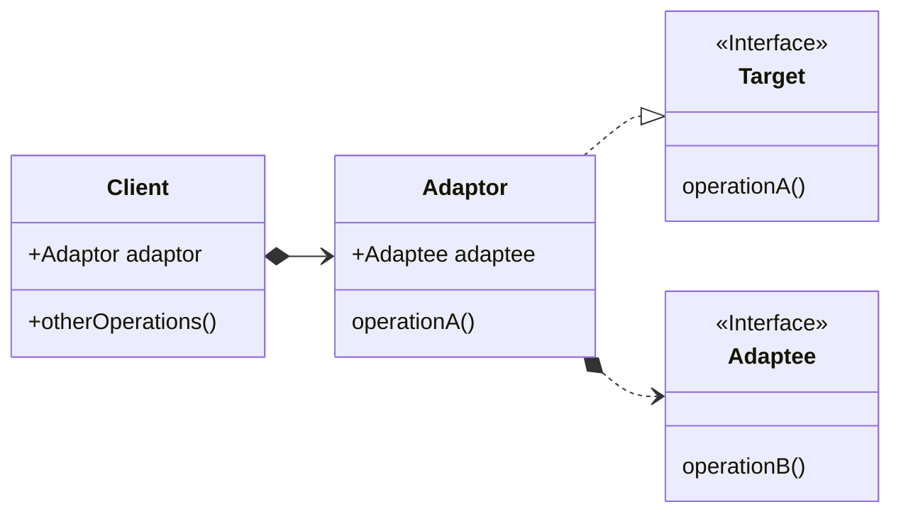

## 适配器模式

适配器模式将一个类的接口，转换成客户期望的另一个接口。
适配器模式可以让原本接口不兼容的类可以合作无间。

<!--more-->

### 设计原则

- 针对接口编程，而不是针对实现编程
- 多用组合，少用继承
- 为交互对象之间的松耦合而努力
- 类应该对拓展开放，而对修改关闭 （开放-关闭原则）
- 依赖抽象，而不依赖具体类 （依赖倒置原则）

### UML简图


classDiagram
direction LR
class Client{
    +Adaptor adaptor
    +otherOperations()
}
class Target {
    << Interface >>
    operationA()
}
Client *--> Adaptor
Adaptor ..|> Target
Adaptor *..> Adaptee
class Adaptor {
    +Adaptee adaptee
    operationA()
}
class Adaptee {
    << Interface >>
    operationB()
}




### 要点

1. 适配器模式，通过创建"适配器"进行接口转换，可以让不兼容的接口变得兼容。
2. 适配器模式让客户从接口的实现解耦。
3. 注意适配器和装饰模式的区别，适配器改变接口以让其对不兼容的对象可用，
装饰模式是通过继承，赋予类新的行为和"职责"。
4. 当需要使用一个现有的类而可用的接口并不适配时，考虑使用适配器模式。

> 对象适配器和类适配器
> > 在Java中，看不到类适配器。类适配器，只有在支持多继承（C++）的语言中
> 适用。类似配器，就是被适配的对象为实例类，同时适配器继承之。


### 示例代码

> Generated by `Gemini 1.5-flash`, revised.

示例代码展示了如何让普通的媒体播放器具备播放vlc和mp4的能力。

#### Target

```java
// 目标接口（Target） 
// 普通的媒体播放器
interface MediaPlayer {
    void play(String audioType, String fileName);
}
```

#### Adaptee

```java
// 要适配的接口（Adaptee）
interface AdvancedMediaPlayer {
    void playVlc(String fileName);
    void playMp4(String fileName);
}
// 适配者的实现（Adaptee‘s implements）
class VlcPlayer implements AdvancedMediaPlayer {
    @Override
    public void playVlc(String fileName) {
        System.out.println("正在播放 VLC 文件: " + fileName);
    }
    @Override
    public void playMp4(String fileName) {
            // do nothing
    }
}

class Mp4Player implements AdvancedMediaPlayer {
    @Override
    public void playVlc(String fileName) {
        // do nothing
    }
    @Override
    public void playMp4(String fileName) {
        System.out.println("正在播放 MP4 文件: " + fileName);
    }
}
```

#### Adapter

```java
// 适配器类（Adapter）
class MediaAdapter implements MediaPlayer {
    private AdvancedMediaPlayer mediaPlayer;

    public MediaAdapter(String audioType) {
        if (audioType.equalsIgnoreCase("vlc")) {
            mediaPlayer = new VlcPlayer();
        } else if (audioType.equalsIgnoreCase("mp4")) {
            mediaPlayer = new Mp4Player();
        }
    }
    @Override
    public void play(String audioType, String fileName) {
         if (audioType.equalsIgnoreCase("vlc")) {
            mediaPlayer.playVlc(fileName);
        } else if (audioType.equalsIgnoreCase("mp4")) {
            mediaPlayer.playMp4(fileName);
        }
    }
}
```

#### 客户端

```java
// 客户端类
class AudioPlayer implements MediaPlayer {
    private MediaAdapter adapter;

    public void play(String audioType, String fileName) {
        if (audioType.equalsIgnoreCase("mp3")) {
            System.out.println("正在播放 MP3 文件: " + fileName);
        } else if (audioType.equalsIgnoreCase("vlc") || audioType.equalsIgnoreCase("mp4")) {
            adapter = new MediaAdapter(audioType);
            adapterplay(audioType, fileName);
        } else {
            System.out.println("不支持的文件格式");
        }
    }
}

public class AdapterPatternDemo {
    public static void main(String[] args) {
        AudioPlayer audioPlayer = new AudioPlayer();
        audioPlayer.play("mp3", "beyond the horizon.mp3");
        audioPlayer.play("vlc", "far far away.vlc");
        audioPlayer.play("mp4", "alone.mp4");
    }
}
```

### 话外

感觉有点怪，究竟是怎样的场景，需要使用到适配器模式？我想肯定不会是
开发计划期或alpha版本开发期。

出现需要使用适配器的场景，应该是出现在代码迭代期，可能有更新版本（不兼容）
的API需要适配，又为了避免大量修改已经存在的代码。

可能，适配器模式是代码系统优化或者重构的时候，需要考虑的模式?

1. [适配器模式的示例代码](https://github.com/wangy325/java-review/blob/99051e3740eeb8c096e76ac08233c8b01c428c18/src/main/java/com/wangy/designpattern/structure/adaptor)
