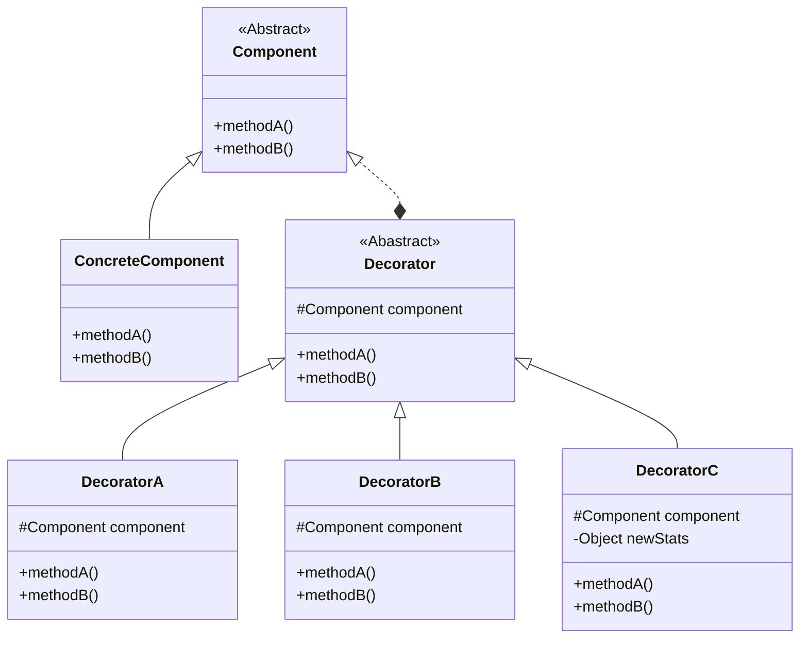

## 装饰者模式

- by Head First 设计模式:
  > 动态地将责任附加到对象上。若要拓展功能，装饰者模式提供了比继承更有弹性的替代方案。

- by Dive into Design Patterns:
  > Also known as *Wrapper*
  >
  > Decorator is a structural design pattern that lets you attach new behaviors
    to objects by placing these objects inside special wrapper objects that
    contain the behaviors.

    <!--more-->

### 设计原则

1. 找出应用之中可以变化之处，把它们独立出来，不要和那些不需要变化的代码混在一起
2. 针对接口编程，而不是针对实现编程
3. 多用组合，少用继承
4. 为交互对象的*松耦合*设计而努力
5. 对象应对拓展开放，而对修改关闭（开闭原则）
   - 听起来很矛盾，但是确实有一些OO技巧，允许系统在不修改代码的情况下，进行功能拓展（想想观察者模式）。
   - 装饰者模式也是一个好例子，完全遵循开放-关闭原则
   - 通常，设计无法完全遵循开放-关闭原则。也没有必要让所有的代码都强行按照这个原则去设计，强行如此做
     只会增加工作量，并且让代码更加复杂。

### UML简图


classDiagram
class Component {
  << Abstract >>
  +methodA()
  +methodB()
}

Component <|-- ConcreteComponent
class ConcreteComponent {
  +methodA()
  +methodB()
}

Component <|..* Decorator
class Decorator {
  << Abastract >>
  #Component component
  +methodA()
  +methodB()
}

Decorator <|-- DecoratorA
class DecoratorA {
  #Component component
  +methodA()
  +methodB()
}

Decorator <|-- DecoratorB
class DecoratorB {
  #Component component
  +methodA()
  +methodB()
}

Decorator <|-- DecoratorC
class DecoratorC {
  #Component component
  -Object newStats
  +methodA()
  +methodB()
}




### 示例代码

> Generated by chatgpt.

装饰者模式（Decorator Pattern）是一种结构型设计模式，它允许向一个现有的对象添加新的功能，同时又不改变其结构。这种类型的设计模式属于结构型模式，它是作为现有类的一个包装。

这个模式创建了一个装饰类，用来包装原有的类，并在保持原有类方法签名完整性的前提下，提供了额外的功能。

下面是一个简单的装饰者模式的示例代码，展示了如何为简单的饮料添加不同的调料装饰。

首先，创建一个Beverage接口和几个实现了Beverage接口的具体饮料类：

```java
// 饮料接口
public interface Beverage {
    String getDescription();
    double cost();
}

// 具体饮料类：咖啡
class Coffee implements Beverage {
    @Override
    public String getDescription() {
        return "Coffee";
    }

    @Override
    public double cost() {
        return 1.99;
    }
}

// 具体饮料类：茶
class Tea implements Beverage {
    @Override
    public String getDescription() {
        return "Tea";
    }

    @Override
    public double cost() {
        return 1.49;
    }
}
```

接下来，创建一个装饰者抽象类，它实现了Beverage接口：

```java
// 装饰者抽象类
abstract class CondimentDecorator implements Beverage {
    protected Beverage beverage;
}
```

然后，实现具体的装饰者类，为饮料添加不同的调料：

```java
// 具体装饰者：牛奶
class Milk extends CondimentDecorator {
    public Milk(Beverage beverage) {
        this.beverage = beverage;
    }

    @Override
    public String getDescription() {
        return beverage.getDescription() + ", Milk";
    }

    @Override
    public double cost() {
        return beverage.cost() + 0.50;
    }
}

// 具体装饰者：糖
class Sugar extends CondimentDecorator {
    public Sugar(Beverage beverage) {
        this.beverage = beverage;
    }

    @Override
    public String getDescription() {
        return beverage.getDescription() + ", Sugar";
    }

    @Override
    public double cost() {
        return beverage.cost() + 0.20;
    }
}
```

最后，使用装饰者模式来装饰饮料：

```java
public class DecoratorPatternDemo {
    public static void main(String[] args) {
        Beverage coffee = new Coffee();
        System.out.println(coffee.getDescription() + " $" + coffee.cost());

        Beverage tea = new Tea();
        tea = new Milk(tea);
        tea = new Sugar(tea);
        System.out.println(tea.getDescription() + " $" + tea.cost());
    }
}
```

在这个示例中，Coffee和Tea是两种饮料，我们通过Milk和Sugar装饰者来为它们添加额外的调料。这样，我们可以动态地为饮料添加任意数量的调料，而不需要修改原有的饮料类。

### 笔记

1. 继承属于拓展的形式之一，但是不见得是达到弹性拓展的最佳方式。
2. 在我们的设计中，应该允许行为可以被拓展，而无需修改现有的代码。
3. *组合和委托*可用于运行时动态地加上新行为。
4. 除了继承，装饰者也可以让我们拓展行为。
5. **装饰者模式**意味着**一群**装饰者类，用来包装具体的*组件*
6. 装饰者可以在被装饰者前面/后面加上自己的行为，或者替代被装饰者的行为，以达到目的。
7. 如有必要，装饰者可以无限制地使用。
8. 装饰者一般对组件的客户是透明的，除非客户程序依赖组件的具体类型。
9. 装饰者模式会导致设计中多出许多小类，如果过度使用，**会让程序变得复杂**。

---

1. [装饰器模式示例代码](https://github.com/wangy325/java-review/blob/d6d740b5a9b5de3f7d64579288b1b8c96c8b8da5/src/main/java/com/wangy/designpattern/structure/decorator)
